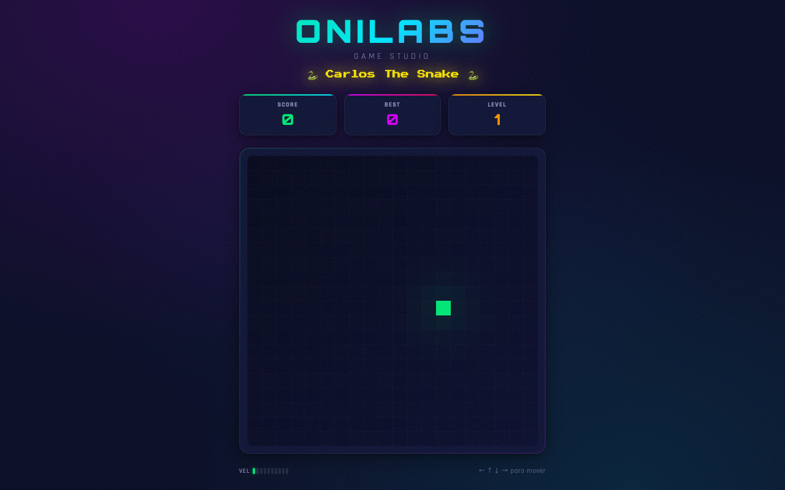

  <b>🐍 Carlos The Snake</b> 
  Un Snake de estética neón hecho por ONILABS — todo en un solo archivo HTML.

  

  
  
  
  

---

## Qué hace

Ayudás a **Carlos**, la serpiente, a comer y crecer. Un Snake clásico con estética neón, niveles que aceleran la velocidad a medida que sumás puntos, y un récord que persiste en tu navegador.

## Funcionalidades

- Estilo neón con gradientes animados y efecto de brillo.
- Dificultad progresiva: **sube de nivel cada 50 puntos** y acelera.
- Récord guardado en `localStorage` (`carlos_best`).
- Controles táctiles (D-pad y swipe) para móvil.
- Pantallas de inicio y *game over* con el puntaje final.

## Jugar

**[anthoniriv.github.io/juego-snake](https://anthoniriv.github.io/juego-snake/)** · [Ver código](https://github.com/anthoniriv/juego-snake)

## Controles

| Entrada | Acción |
|---------|--------|
| ⌨️ Flechas / WASD | Mover |
| Espacio / Enter | Empezar |
| 📱 D-pad o swipe | Mover (móvil) |

## Uso local

Abrí `index.html` en cualquier navegador — sin build, sin dependencias.

## Tecnologías

| Capa | Stack |
|------|-------|
| Lógica | JavaScript (vanilla) |
| Render | HTML5 Canvas |
| Estilos | CSS inline (un solo archivo) |

---

Hecho con ❤️ por <a href="https://github.com/anthoniriv">ONILABS</a>

